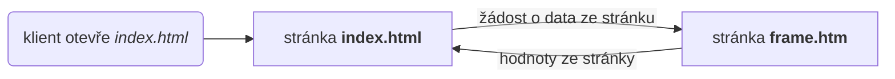

# Simens PLC Webserver

Jednoduché demo, které demonstruje postup, jak vizualizovat data z Simens PLC pomoci webserveru tak, aby se hodnoty měnili a stránka se nemusela neustále znovu načítat.

## Popis principu



Soubor `index.html` zobrazuje hodnoty. Renderuje pouze při prvním načtení. S pravidelností definovanou v proměnné `interval` žádá pomocí knihvny *jquery* o hodnoty ze stránky `frame.htm`, která vrací pouze proměnné vyrenderované jádrem Simes PLC.


## Převod sekund na string času

Zavolání fce `convertSecondsToHHMMSS()` vrátí string s časem ve formátu `hh:mm::ss`. Kód je v souboru `sec2time.sj`.

### Ukázka
```js
const secString = :="BlokPoverUp":; // vloži text z proměnné
const sec = parseInt(secString); // převede text na int
convertSecondsToHHMMSS(sec); // vrátí string ve formě hh:mm:ss
```

## Odkazy
- simens datasheet: https://cache.industry.siemens.com/dl/files/496/68011496/att_959527/v2/68011496_Examples_for_S7WebServer_DOC_v21_en.pdf