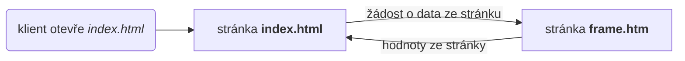

# Simens PLC Webserver

Jednoduché demo, které demonstruje postup, jak vizualizovat data z Simens PLC pomoci webserveru tak, aby se hodnoty měnili a stránka se nemusela neustále znovu načítat.

## Popis principu

Soubor `index.html` zobrazuje hodnoty. Renderuje pouze při prvním načtení. S pravidelností definovanou v proměnné `interval` žádá pomocí knihvny *jquery* o hodnoty ze stránky `frame.htm`, která vrací pouze proměnné vyrenderované jádrem Simes PLC.

## Odkazy
- simens datasheet: https://cache.industry.siemens.com/dl/files/496/68011496/att_959527/v2/68011496_Examples_for_S7WebServer_DOC_v21_en.pdf